<div align="center">
  
  <h1>Recurly</h1>
  <p><strong>Never lose track of a subscription again.</strong></p>
  <p>A beautifully designed mobile app to track, manage, and stay on top of all your recurring subscriptions — from Netflix to Adobe, and everything in between.</p>

  <p>
    
    
    
    
    
    
    
    
    
    
    
    
    
    
    
  </p>
</div>

---

## Screenshots

<div align="center">
  <table>
    <tr>
      <td align="center"><b>Sign In</b></td>
      <td align="center"><b>Sign Up</b></td>
      <td align="center"><b>Email Verification</b></td>
    </tr>
    <tr>
      <td>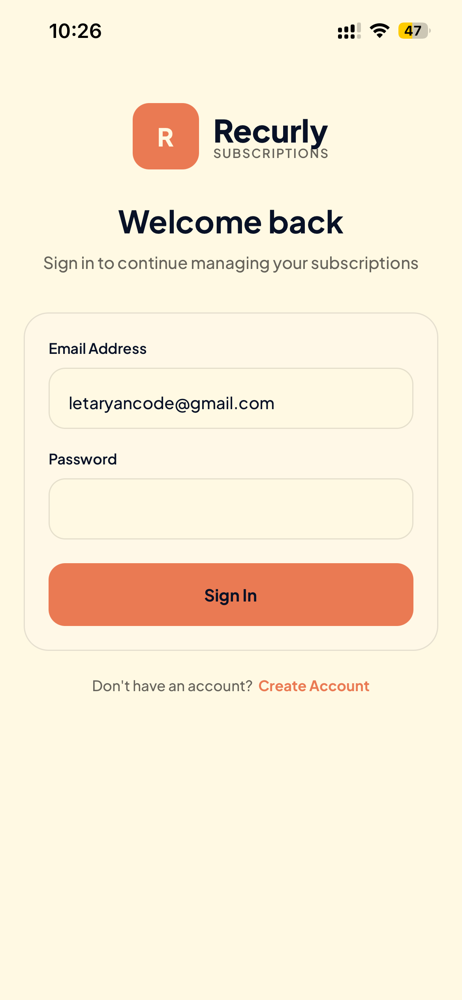</td>
      <td>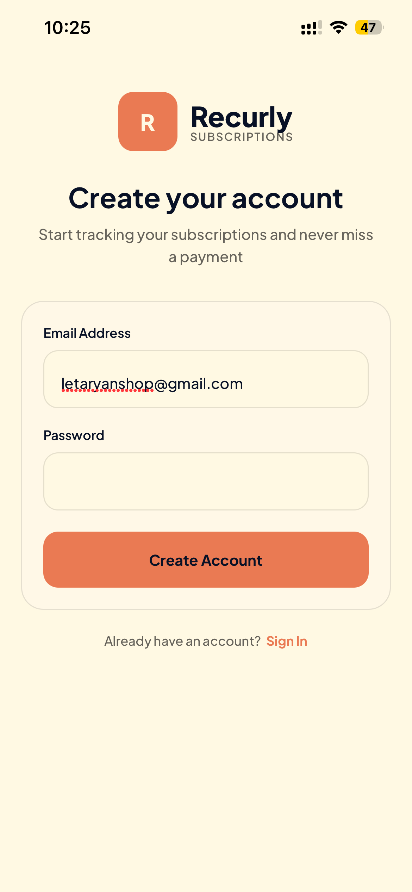</td>
      <td>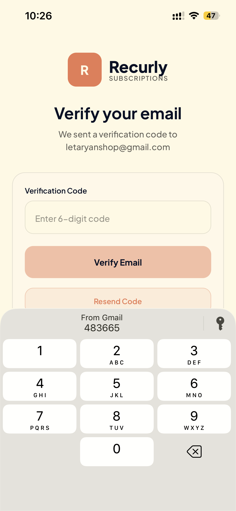</td>
    </tr>
    <tr>
      <td align="center"><b>Home — Overview</b></td>
      <td align="center"><b>Home — All Subscriptions</b></td>
      <td align="center"><b>New Subscription Added</b></td>
    </tr>
    <tr>
      <td>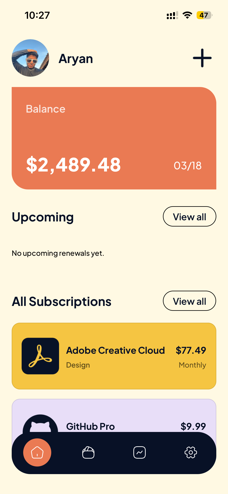</td>
      <td>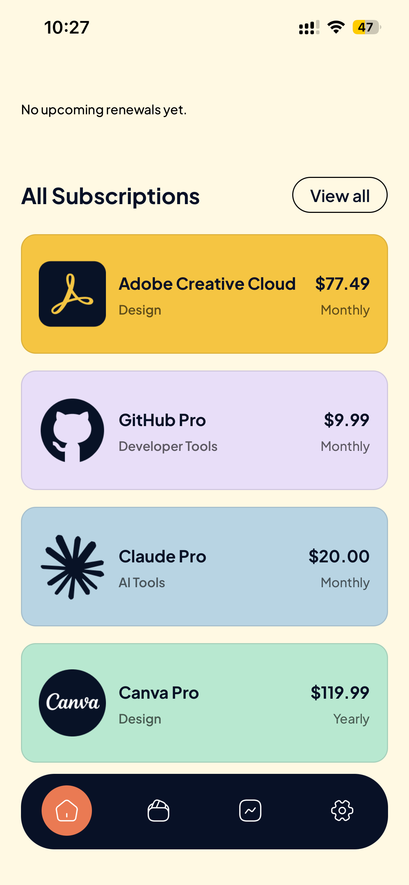</td>
      <td>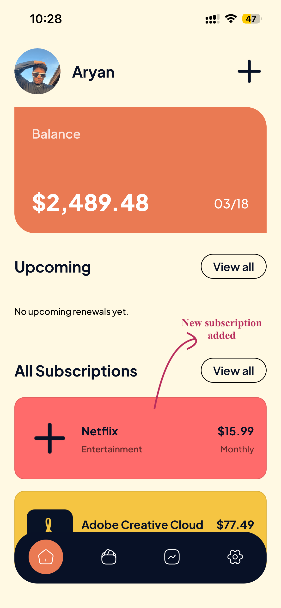</td>
    </tr>
    <tr>
      <td align="center"><b>Add Subscription</b></td>
      <td align="center"><b>Subscriptions List</b></td>
      <td align="center"><b>Expanded Card</b></td>
    </tr>
    <tr>
      <td>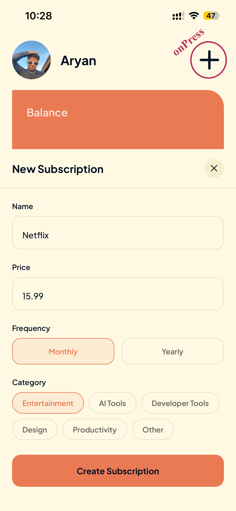</td>
      <td>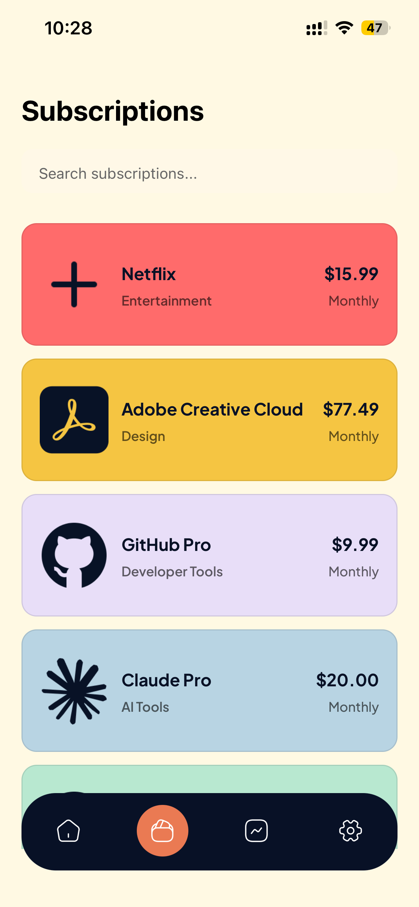</td>
      <td>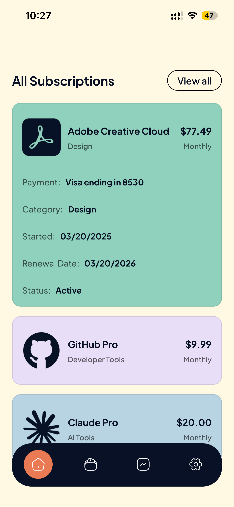</td>
    </tr>
    <tr>
      <td align="center"><b>Search & Filter</b></td>
      <td align="center"><b>Settings</b></td>
      <td></td>
    </tr>
    <tr>
      <td>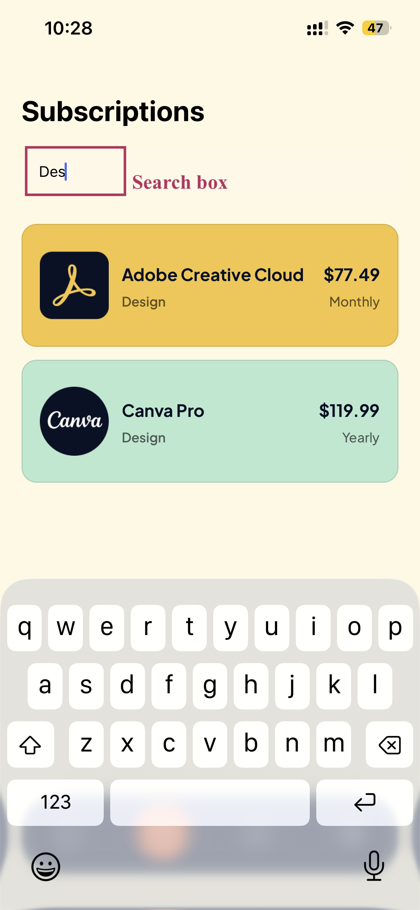</td>
      <td>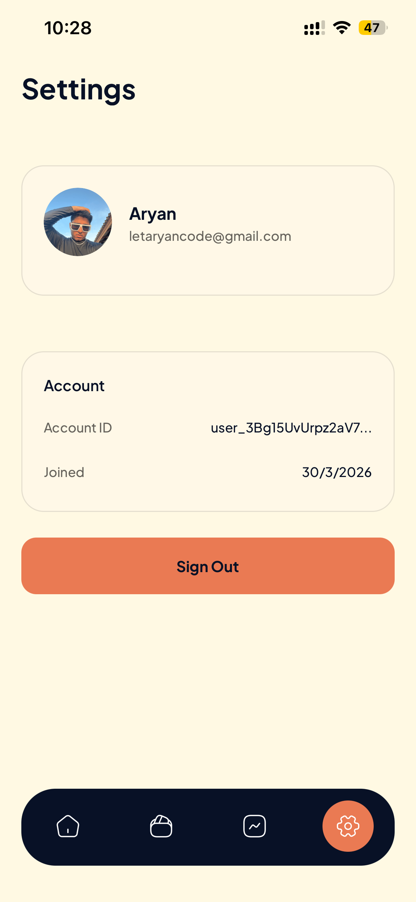</td>
      <td></td>
    </tr>
  </table>
</div>

---

## Features

- **Balance Dashboard** — See your total monthly/yearly subscription spend and your next upcoming renewal date at a glance.
- **Upcoming Renewals** — A horizontally scrollable strip on the home screen highlights subscriptions renewing within the next 7 days so nothing catches you off guard.
- **Add Subscriptions** — Create subscriptions with a name, price, billing frequency (monthly or yearly), and one of six predefined categories: Entertainment, AI Tools, Developer Tools, Design, Productivity, or Other.
- **Expandable Subscription Cards** — Tap any card to reveal its payment method, category, start date, renewal date, and current status (Active, Paused, or Cancelled).
- **Search & Filter** — The Subscriptions tab includes a live search bar that filters across name, category, and plan in real time.
- **Secure Authentication** — Full sign-up, sign-in, and email OTP verification flow powered by Clerk, with MFA support and secure token storage.
- **User Settings** — View your profile, account ID, and join date, and sign out cleanly from the Settings tab.
- **Product Analytics** — Every meaningful user action (screen views, subscription creation, sign-in/out) is tracked via PostHog for product insight.

---

## Tech Stack

| Technology                       | Role in Recurly                                                                                                                                                                                                                      |
| -------------------------------- | ------------------------------------------------------------------------------------------------------------------------------------------------------------------------------------------------------------------------------------ |
| **Expo**                         | Core development platform — handles the build system, native module bridging, splash screen, fonts, and the Expo Go / EAS workflow for iOS & Android.                                                                                |
| **React Native**                 | The underlying cross-platform UI framework. All screens and components render as native iOS/Android views.                                                                                                                           |
| **Expo Router**                  | File-based routing (Next.js-style) for the entire navigation tree — auth group, tab group, and dynamic subscription detail routes.                                                                                                   |
| **React Navigation**             | Powers the bottom tab bar with a custom pill-style active indicator and safe-area-aware layout.                                                                                                                                      |
| **TypeScript**                   | Strict static typing across all screens, components, stores, and constants, including global `Subscription` and `UpcomingSubscription` interface definitions.                                                                        |
| **NativeWind + Tailwind CSS**    | Utility-first styling via Tailwind class names directly in React Native components. NativeWind bridges the two environments at compile time via PostCSS.                                                                             |
| **Zustand**                      | Lightweight global state management for the subscription list — add, reset, and hydrate subscriptions without boilerplate.                                                                                                           |
| **Clerk**                        | End-to-end authentication: sign-up, sign-in, email OTP/MFA verification, session management, and user metadata. Credentials are cached securely via `expo-secure-store`.                                                             |
| **PostHog**                      | Product analytics — tracks screen navigation, subscription lifecycle events (created, expanded, collapsed), auth events (sign-in success/failure, sign-out), and MFA flows.                                                          |
| **Day.js**                       | Lightweight date manipulation for computing renewal dates, days-until-renewal, and formatting display dates throughout the app.                                                                                                      |
| **Expo Image**                   | Optimised image component used for subscription service icons and user profile avatars.                                                                                                                                              |
| **React Native Reanimated**      | Smooth, physics-based animations for modal transitions and expandable card state changes.                                                                                                                                            |
| **React Native Gesture Handler** | Native-driven touch handling that powers swipe gestures and interactive card expansion.                                                                                                                                              |
| **Expo Haptics**                 | Subtle haptic feedback on key interactions for a polished, native-feeling experience.                                                                                                                                                |
| **Plus Jakarta Sans**            | The app's custom typeface, loaded via `expo-font` and applied globally for a consistent, modern typographic voice.                                                                                                                   |
| **CodeRabbit**                   | AI-powered code review integrated into every pull request — surfaced senior-engineer-level feedback, caught edge cases, enforced best practices, and suggested targeted refactors that kept the codebase clean and production-ready. |

---

## Project Structure

```
recurly/
├── app/
│   ├── _layout.tsx              # Root layout: auth guard, PostHog provider, font loading
│   ├── onboarding.tsx           # Onboarding entry screen
│   ├── (auth)/
│   │   ├── sign-in.tsx          # Email + password sign-in with MFA support
│   │   └── sign-up.tsx          # Account creation with OTP email verification
│   └── (tabs)/
│       ├── _layout.tsx          # Bottom tab navigator configuration
│       ├── index.tsx            # Home: balance card, upcoming renewals, all subscriptions
│       ├── subscriptions.tsx    # Full subscription list with live search
│       ├── insights.tsx         # Insights placeholder (coming soon)
│       └── settings.tsx         # User profile, account info, sign-out
├── components/
│   ├── SubscriptionCard.tsx         # Expandable subscription card
│   ├── UpcomingSubscriptionCard.tsx # Compact card for upcoming renewals strip
│   ├── CreateSubscriptionModal.tsx  # Bottom sheet form: add new subscription
│   └── ListHeading.tsx              # Section heading with optional action label
├── lib/
│   ├── subscriptionStore.ts    # Zustand store (add / set / reset subscriptions)
│   └── utils.ts                # Currency formatter, date formatter, status helpers
├── constants/
│   ├── data.ts                 # Mock subscription data and balance seed
│   ├── theme.ts                # Design tokens: colors, spacing, component sizes
│   ├── icons.ts                # Centralised icon imports
│   └── images.ts               # Centralised image imports
├── src/config/
│   └── posthog.ts              # PostHog client initialisation and config
├── assets/
│   ├── fonts/                  # Plus Jakarta Sans (all weights)
│   └── images/                 # App icon, splash screen, subscription service logos
├── app.json                    # Expo static config (name, slug, plugins, scheme)
├── app.config.js               # Dynamic Expo config (reads .env for API keys)
├── global.css                  # Tailwind CSS v4 directives and custom global classes
├── metro.config.js             # Metro bundler config with NativeWind preset
└── type.d.ts                   # Global TypeScript interface declarations
```

---

## Getting Started

### Prerequisites

- [Node.js](https://nodejs.org/) >= 18
- [Expo CLI](https://docs.expo.dev/get-started/installation/) — `npm install -g expo-cli`
- A [Clerk](https://clerk.com/) account for authentication
- A [PostHog](https://posthog.com/) account for analytics (optional but recommended)

### Installation

1. **Clone the repository**

   ```bash
   git clone https://github.com/aryan-mehta05/recurly.git
   cd recurly
   ```

2. **Install dependencies**

   ```bash
   npm install
   ```

3. **Configure environment variables**

   Create a `.env` file in the project root:

   ```env
   EXPO_PUBLIC_CLERK_PUBLISHABLE_KEY=your_clerk_publishable_key
   EXPO_PUBLIC_POSTHOG_API_KEY=your_posthog_api_key
   EXPO_PUBLIC_POSTHOG_HOST=https://us.i.posthog.com
   ```

4. **Start the development server**

   ```bash
   npx expo start
   ```

   Then press:
   - `i` to open in the iOS Simulator
   - `a` to open in the Android Emulator
   - `s` to open in Expo Go on a physical device

---

## Environment Variables

| Variable                            | Description                                                               |
| ----------------------------------- | ------------------------------------------------------------------------- |
| `EXPO_PUBLIC_CLERK_PUBLISHABLE_KEY` | Your Clerk publishable key — required for authentication to function.     |
| `EXPO_PUBLIC_POSTHOG_API_KEY`       | Your PostHog project API key — analytics are silently disabled if absent. |
| `EXPO_PUBLIC_POSTHOG_HOST`          | PostHog ingestion host (e.g. `https://us.i.posthog.com`).                 |

---

<div align="center">
  <p>Built with care by <a href="https://github.com/aryan-mehta05">Aryan Mehta</a>. 👨🏻‍💻❤️</p>
</div>
